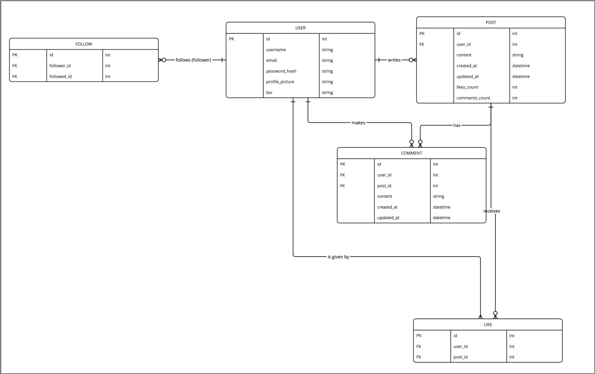

# Ethan Cornwill T2A2 API Application

# SocialAPI

## Problem and Solution

**Problem:** The difficulty for developers to create social media features within their applications.

**Solution:** My API provides a comprehensive set of endpoints and functionalities to enable developers to easily integrate social media features into their applications. This includes user profiles, post creation and management, commenting and liking, following and unfollowing, and messaging.

## Task Allocation and Tracking

* **Project Management Tool:** Utilise a tool like Trello or Asana to create boards, tasks, and assign them to team members.
* **Task Breakdown:** Break down the project into smaller, manageable tasks, such as designing the database, implementing API endpoints, and testing.
* **Timelines:** Set deadlines for each task and track progress to ensure timely completion.
* **Collaboration:** Use tools like GitHub or GitLab for version control and collaboration among team members.

## Third-Party Services, Packages, and Dependencies

* **Flask:** Python web framework for building APIs.
* **SQLAlchemy:** ORM for interacting with the database.
* **JWT:** For token-based authentication and authorisation.
* **Marshmallow:** For data validation and serialisation.
* **PostgreSQL:** Relational database for storing user data, posts, comments, and other information.

## Database System Benefits and Drawbacks

### Benefits of PostgreSQL:

* **Open-source:** Free to use and distribute.
* **Robust:** Reliable and scalable for handling large datasets.
* **Rich features:** Supports advanced features like full-text search, JSONB data type, and spatial data.
* **Active community:** Strong community support and resources available.

### Drawbacks of PostgreSQL:

* **Learning curve:** Can be more complex to learn and configure compared to simpler databases.
* **Performance:** May require optimisation for very large datasets or high-traffic applications.

## ORM Features and Functionalities

### SQLAlchemy:

* **Object-relational mapping:** Maps Python classes to database tables.
* **Querying:** Provides a high-level API for querying the database using Python syntax.
* **Relationships:** Handles relationships between objects (e.g., one-to-many, many-to-many).
* **Migrations:** Automatically generates database schema changes based on model modifications.
* **Declarative syntax:** Uses a declarative style for defining models and relationships.

## Entity Relationship Diagram (ERD)



The ERD illustrates the relationships between entities in the database:

* **User:** A user has many posts, comments, and likes.
* **Post:** A post belongs to a user and can have many comments and likes.
* **Comment:** A comment belongs to a user and a post.
* **Like:** A like belongs to a user and a post.
* **Follow:** A follow relationship connects two users.

These relationships help ensure data integrity and consistency in the database.

## Implemented Models and Relationships

### Models:

* **User:** `id`, `username`, `email`, `password_hash`
* **Post:** `id`, `user_id`, `content`, `created_at`, `updated_at`
* **Comment:** `id`, `user_id`, `post_id`, `content`, `created_at`, `updated_at`
* **Like:** `id`, `user_id`, `post_id`, `created_at`
* **Follow:** `id`, `follower_id`, `followed_id`

### Relationships: 

* A `User` has many `Posts`, `Comments`, and `Likes`.
* A `Post` belongs to a `User` and can have many `Comments` and `Likes`.
* A `Comment` belongs to a `User` and a `Post`.
* A `Like` belongs to a `User` and a `Post`.
* A `Follow` connects two `Users` (follower and followed).

### How Relationships Aid Implementation:**

* **Data integrity:** Relationships ensure data consistency and prevent inconsistencies. For example, a `Comment` must always belong to a `User` and a `Post`.
* **Efficient querying:** Relationships allow for efficient querying of related data. For example, to get all comments on a post, we can use the `post.comments` relationship.
* **Cascade operations:** Relationships can be used to cascade operations. For example, if a `User` is deleted, their associated `Posts`, `Comments`, and `Likes` can be automatically deleted.

## API Endpoints

## Expanded API Endpoints

### **Users**

* **GET /users**
    * **HTTP Method:** GET
    * **Request Parameters:**
      * `page` (optional): Page number for pagination
      * `per_page` (optional): Number of users per page
    * **Authorisation**: JWT token required in the `Auth` header.
    * **Response Format:** JSON array of user objects (id, username, email, profile_picture, bio)
    * **Example Request:**
        ```
        curl -H "Authorization: Bearer <your_token>" http://localhost:5000/users
        ```
    * **Example Response:**
        ```json
        [
            {"id": 1, "username": "user1", "email": "user1@example.com", "profile_picture": "https://example.com/profile1.jpg", "bio": "This is user 1."},
            {"id": 2, "username": "user2", "email": "user2@example.com", "profile_picture": "https://example.com/profile2.jpg", "bio": "This is user 2."}
        ]
        ```

* **GET /users/<user_id>**
    * **HTTP Method:** GET
    * **Request Parameters:**
        - `user_id`: ID of the user to retrieve
    - **Authorisation:** JWT token required in the `Authorisation` header
    * **Response Format:** JSON object representing the user
    * **Example Request:**
        ```
        curl -H "Authorization: Bearer <your_token>" http://localhost:5000/users/1
        ```
    * **Example Response:**
        ```json
        {
            "id": 1,
            "username": "user1",
            "email": "user1@example.com",
            "profile_picture": "https://example.com/profile1.jpg",
            "bio": "This is user 1."
        }
        ```

* **POST /users**
    * **HTTP Method:** POST
    * **Request Parameters:**
        - `username`
        - `email`
        - `password`
    * **Response Format:** JSON object representing the newly created user
    * **Example Request:**
        ```
        curl -X POST http://localhost:5000/users -d '{"username": "newuser", "email": "newuser@example.com", "password": "password123"}'
        ```
    * **Example Response:**
        ```json
        {
            "id": 3,
            "username": "newuser",
            "email": "newuser@example.com",
            "profile_picture": null,
            "bio": null
        }
        ```

* **PUT /users/<user_id>**
    * **HTTP Method:** PUT
    * **Request Parameters:**
        - `user_id`: ID of the user to update
        - `username` (optional)
        - `email` (optional)
        - `profile_picture` (optional)
        - `bio` (optional)
    * **Response Format:** JSON object representing the updated user
    * **Example Request:**
        ```
        curl -X PUT http://localhost:5000/users/1 -d '{"username": "updateduser"}'
        ```
    * **Example Response:**
        ```json
        {
            "id": 1,
            "username": "updateduser",
            "email": "user1@example.com",
            "profile_picture": "https://example.com/profile1.jpg",
            "bio": "This is user 1."
        }
        ```

* **DELETE /users/<user_id>**
    * **HTTP Method:** DELETE
    * **Request Parameters:**
        - `user_id`: ID of the user to delete
    * **Response Format:** No response body
    * **Example Request:**
        ```
        curl -X DELETE http://localhost:5000/users/1
        ```

### **Posts**

* **GET /posts**
    * **HTTP Method:** GET
    * **Request Parameters:**
        - `page` (optional): Page number for pagination
        - `per_page` (optional): Number of posts per page
    * **Response Format:** JSON array of post objects (id, user_id, content, created_at, updated_at, likes_count, comments_count)
    * **Example Request:**
        ```
        curl http://localhost:5000/posts
        ```
    * **Example Response:**
        ```json
        [
            {"id": 1, "user_id": 1, "content": "This is a post.", "created_at": "2023-12-31T23:59:59Z", "updated_at": "2023-12-31T23:59:59Z", "likes_count": 0, "comments_count": 0},
            {"id": 2, "user_id": 2, "content": "Another post.", "created_at": "2023-12-31T23:59:58Z", "updated_at": "2023-12-31T23:59:58Z", "likes_count": 1, "comments_count": 2}
        ]
        ```

* **GET /posts/<post_id>**
    * **HTTP Method:** GET
    * **Request Parameters:**
        - `post_id`: ID of the post to retrieve
    * **Response Format:** JSON object representing the post
    * **Example Request:**
        ```
        curl http://localhost:5000/posts/1
        ```
    * **Example Response:**
        ```json
        {
            "id": 1,
            "user_id": 1,
            "content": "This is a post.",
            "created_at": "2023-12-31T23:59:59Z",
            "updated_at": "2023-12-31T23:59:59Z",
            "likes_count": 0,
            "comments_count": 0
        }
        ```

* **POST /posts**
    * **HTTP Method:** POST
    * **Request Parameters:**
        - `content`
    * **Response Format:** JSON object representing the newly created post
    * **Example Request:**
        ```
        curl -X POST http://localhost:5000/posts -d '{"content": "This is a new post."}'
        ```
    * **Example Response:**
        ```json
        {
            "id": 3,
            "user_id": 1,
            "content": "This is a new post.",
            "created_at": "2024-01-01T00:00:00Z",
            "updated_at": "2024-01-01T00:00:00Z",
            "likes_count": 0,
            "comments_count": 0
        }
        ```

* **PUT /posts/<post_id>**
    * **HTTP Method:** PUT
    * **Request Parameters:**
        - `post_id`: ID of the post to update
        - `content` (optional)
    * **Response Format:** JSON object representing the updated post
    * **Example Request:**
        ```
        curl -X PUT http://localhost:5000/posts/1 -d '{"content": "Updated post content."}'
        ```
    * **Example Response:**
        ```json
        {
            "id": 1,
            "user_id": 1,
            "content": "Updated post content.",
            "created_at": "2023-12-31T23:59:59Z",
            "updated_at": "2024-01-01T00:00:00Z",
            "likes_count": 0,
            "comments_count": 0
        }
        ```

* **DELETE /posts/<post_id>**
    * **HTTP Method:** DELETE
    * **Request Parameters:**
        - `post_id`: ID of the post to delete
    * **Response Format:** No response body
    * **Example Request:**
        ```
        curl -X DELETE http://localhost:5000/posts/1
        ```

### **Comments**

* **GET /posts/<post_id>/comments**
    * **HTTP Method:** GET
    * **Request Parameters:**
        - `post_id`: ID of the post to get comments for
        - `page` (optional): Page number for pagination
        - `per_page` (optional): Number of comments per page
    * **Response Format:** JSON array of comment objects (id, user_id, post_id, content, created_at, updated_at)
    * **Example Request:**
        ```
        curl http://localhost:5000/posts/1/comments
        ```
    * **Example Response:**
        ```json
        [
            {"id": 1, "user_id": 2, "post_id": 1, "content": "Great post!", "created_at": "2024-01-01T00:01:00Z", "updated_at": "2024-01-01T00:01:00Z"},
            {"id": 2, "user_id": 3, "post_id": 1, "content": "I agree.", "created_at": "2024-01-01T00:02:00Z", "updated_at": "2024-01-01T00:02:00Z"}
        ]
        ```

* **POST /posts/<post_id>/comments**
    * **HTTP Method:** POST
    * **Request Parameters:**
        - `post_id`: ID of the post to comment on
        - `content`
    * **Response Format:** JSON object representing the newly created comment
    * **Example Request:**
        ```
        curl -X POST http://localhost:5000/posts/1/comments -d '{"content": "This is a comment."}'
        ```
    * **Example Response:**
        ```json
        {
            "id": 3,
            "user_id": 1,
            "post_id": 1,
            "content": "This is a comment.",
            "created_at": "2024-01-01T00:03:00Z",
            "updated_at": "2024-01-01T00:03:00Z"
        }
        ```

* **PUT /comments/<comment_id>**
    * **HTTP Method:** PUT
    * **Request Parameters:**
        - `comment_id`: ID of the comment to update
        - `content` (optional)
    * **Response Format:** JSON object representing the updated comment
    * **Example Request:**
        ```
        curl -X PUT http://localhost:5000/comments/1 -d '{"content": "Updated comment."}'
        ```
    * **Example Response:**
        ```json
        {
            "id": 1,
            "user_id": 2,
            "post_id": 1,
            "content": "Updated comment.",
            "created_at": "2024-01-01T00:01:00Z",
            "updated_at": "2024-01-01T00:03:00Z"
        }
        ```

* **DELETE /comments/<comment_id>**
    * **HTTP Method:** DELETE
    * **Request Parameters:**
        - `comment_id`: ID of the comment to delete
    * **Response Format:** No response body
    * **Example Request:**
        ```
        curl -X DELETE http://localhost:5000/comments/1
        ```

### **Likes**

* **POST /posts/<post_id>/likes**
    * **HTTP Method:** POST
    * **Request Parameters:**
        - `post_id`: ID of the post to like
    * **Response Format:** No response body
    * **Example Request:**
        ```
        curl -X POST http://localhost:5000/posts/1/likes
        ```

* **DELETE /posts/<post_id>/likes**
    * **HTTP Method:** DELETE
    * **Request Parameters:**
        - `post_id`: ID of the post to unlike
    * **Response Format:** No response body
    * **Example Request:**
        ```
        curl -X DELETE http://localhost:5000/posts/1/likes
        ```

### **Follows**

* **POST /users/<user_id>/follow**
    * **HTTP Method:** POST
    * **Request Parameters:**
        - `user_id`: ID of the user to follow
    * **Response Format:** No response body
    * **Example Request:**
        ```
        curl -X POST http://localhost:5000/users/2/follow
        ```

* **DELETE /users/<user_id>/follow**
    * **HTTP Method:** DELETE
    * **Request Parameters:**
        - `user_id`: ID of the user to unfollow
    * **Response Format:** No response body
    * **Example Request:**
        ```
        curl -X DELETE http://localhost:5000/users/2/follow
        ```

### **Search**

* **GET /search**
    * **HTTP Method:** GET
    * **Request Parameters:**
        - `query`: Search query
    * **Response Format:** JSON object with search results for users, posts, and comments
    * **Example Request:**
        ```
        curl http://localhost:5000/search?query=user1
        ```
    * **Example Response:**
        ```json
        {
            "users": [
                {"id": 1, "username": "user1", "email": "user1@example.com", "profile_picture": "https://example.com/profile1.jpg", "bio": "This is user 1."}
            ],
            "posts": [
                {"id": 1, "user_id": 1, "content": "This is a post about user1.", "created_at": "2023-12-31T23:59:59Z", "updated_at": "2023-12-31T23:59:59Z", "likes_count": 0, "comments_count": 0}
            ],
            "comments": []
        }
        ```

### **Notifications**

* **GET /users/<user_id>/notifications**
    * **HTTP Method:** GET
    * **Request Parameters:**
        - `user_id`: ID of the user to get notifications for
        - `page` (optional): Page number for pagination
        - `per_page` (optional): Number of notifications per page
    * **Response Format:** JSON array of notification objects (id, type, message, created_at)
    * **Example Request:**
        ```
        curl http://localhost:5000/users/1/notifications
        ```
    * **Example Response:**
        ```json
        [
            {"id": 1, "type": "post_like", "message": "User2 liked your post.", "created_at": "2024-01-01T00:04:00Z"},
            {"id": 2, "type": "comment", "message": "User3 commented on your post.", "created_at": "2024-01-01T00:05:00Z"}
        ]
        ```

* **POST /notifications/<notification_id>/mark-read**
    * **HTTP Method:** POST
    * **Request Parameters:**
        - `notification_id`: ID of the notification to mark as read
    * **Response Format:** No response body
    * **Example Request:**
        ```
        curl -X POST http://localhost:5000/notifications/1/mark-read
        ```

**Remember to replace `http://localhost:5000` with the actual URL of your API.**


## Prerequisites

* Python 3.6 or later
* PostgreSQL database
* `pip` package manager
* Virtual Environment

## Installation

1. **Install PostgreSQL:**
   * **Windows:** Download and install PostgreSQL from [https://www.postgresql.org/download/](https://www.postgresql.org/download/). Follow the installation instructions.
   * **macOS:** Use Homebrew to install PostgreSQL:
     ```bash
     brew install postgresql
     ```
   * **Linux:** Consult your distribution's package manager for installation instructions.

2. **Create a PostgreSQL user and database:**
   * Open the PostgreSQL command-line interface (psql).
   * Create a new user:
     ```sql
     CREATE USER your_username WITH PASSWORD 'your_password';
     ```
   * Create a new database:
     ```sql
     CREATE DATABASE social_media_api;
     ```
   * Grant privileges to the user:
     ```sql
     GRANT ALL PRIVILEGES ON DATABASE social_media_api TO your_username;
     ```
    * Connect to the database:
    ```sql
        \connect social_media_api
    ```
    * Grant privileges to the user with the public schema:
    ```sql
    GRANT USAGE ON SCHEMA public TO your_username;
    ```


3. **Clone the repository:**
   ```bash
   git clone https://github.com/finneh4249/t2a2-api-application.git
   ```

4. **Create a virtual environment:**
   ```bash
   python -m venv venv
   source venv/bin/activate  # On Windows: venv\bin\activate.ps1
   ```

5. **Install dependencies:**
   ```bash
   pip install -r requirements.txt
   ```

6. **Configure database settings:**
   Update the `.env.example` file with your database connection details, including the username, password, database name, and host.
   Rename the `.env.example` file to `.env`.

7. **Create the database:**
   Run `flask db create`, then `flask db seed` to create and seed the database with default values.

**Usage:**

1. **Run the application:**
   ```bash
   flask run
   ```

2. **Access API endpoints:**
   Use your preferred HTTP client (e.g., Postman, curl) to interact with the API endpoints.


## Additional Information

* **Authentication:** Use token-based authentication for user authorisation.
* **Error handling:** The API returns appropriate HTTP status codes and error messages.
* **Pagination:** For large result sets, pagination is supported.
* **Rate limiting:** To prevent abuse, rate limiting is implemented.


## Prerequisites

* Python 3.6 or later
* PostgreSQL database
* `pip` package manager
* Virtual Environment

## Installation

1. **Install PostgreSQL:**
   * **Windows:** Download and install PostgreSQL from [https://www.postgresql.org/download/](https://www.postgresql.org/download/). Follow the installation instructions.
   * **macOS:** Use Homebrew to install PostgreSQL:
     ```bash
     brew install postgresql
     ```
   * **Linux:** Consult your distribution's package manager for installation instructions.

2. **Create a PostgreSQL user and database:**
   * Open the PostgreSQL command-line interface (psql).
   * Create a new user:
     ```sql
     CREATE USER your_username WITH PASSWORD 'your_password';
     ```
   * Create a new database:
     ```sql
     CREATE DATABASE social_media_api;
     ```
   * Grant privileges to the user:
     ```sql
     GRANT ALL PRIVILEGES ON DATABASE social_media_api TO your_username;
     ```

3. **Clone the repository:**
   ```bash
   git clone https://github.com/finneh4249/t2a2-api-application.git
   ```

4. **Create a virtual environment:**
   ```bash
   python -m venv venv
   source venv/bin/activate  # On Windows: venv\bin\activate.ps1
   ```

5. **Install dependencies:**
   ```bash
   pip install -r requirements.txt
   ```

6. **Configure database settings:**
   Update the `.env.example` file with your database connection details, including the username, password, database name, and host.
   Rename the `.env.example` file to `.env`.

7. **Create the database:**
  
   Run 
   ```bash
   flask db create
   ```
   then
  ```bash
  flask db seed
  ```
  to create and seed the database with default values.

**Usage:**

1. **Run the application:**
   ```bash
   flask run
   ```

2. **Access API endpoints:**
   Use your preferred HTTP client (e.g., Postman, curl, Insomnia, etc) to interact with the API endpoints.


## Additional Information

* **Authentication:** Use token-based authentication for user authorisation.
* **Error handling:** The API returns appropriate HTTP status codes and error messages.
* **Pagination:** For large result sets, pagination is supported.
* **Rate limiting:** To prevent abuse, rate limiting is implemented.


## Design Requirements

The web server must:

- Function as intended
- Store data in a persistent data storage medium (eg. a relational database)
- Appropriately validate and sanitise any data it interacts with
- Use appropriate HTTP web request verbs - following REST conventions - for various types of data manipulation
- Cover the full range of CRUD functionality for data within the database
- The database manipulated by the web server must accurately reflect the entity relationship diagram created for the Documentation Requirements.
- The database tables or documents must be normalised
- API endpoints must be documented in your readme
- Endpoint documentation should include
  - HTTP request verbs
  - Required data where applicable
  - Expected response data
  - Authentication methods where applicable

## Code Requirements

The web server must:

* Use appropriate functionalities or libraries from the relevant programming language in its construction
* Use appropriate model methods to query the database
* Catch errors and handle them gracefully
* Return appropriate error codes and messages to malformed requests
* Use appropriate functions or methods to sanitise & validate data
* Use D.R.Y coding principles
* All queries to the database must be commented with an explanation of how they work and the data they are intended to retrieve
